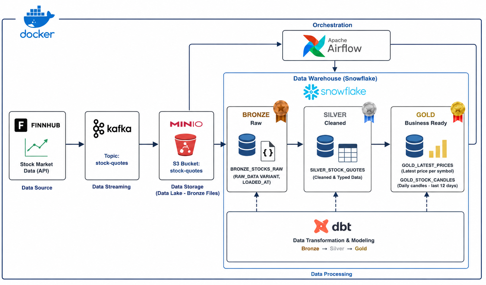

# RealTimeFinHub — Real-Time Stock Market Data Pipeline


---

## Project Overview

**RealTimeFinHub** is an end-to-end real-time data engineering project designed to collect, stream, store, orchestrate, and transform live stock market data.

The pipeline retrieves stock quotes from the **Finnhub API**, publishes them to **Apache Kafka**, stores raw JSON records in **MinIO**, loads them into **Snowflake** through **Apache Airflow**, and transforms the data using **dbt**.

The project follows a **Medallion Architecture** with Bronze, Silver, and Gold layers.

---

## Architecture



### Data Flow

```text
Finnhub API
    ↓
Python Kafka Producer
    ↓
Apache Kafka (Topic: stock-quotes)
    ↓
Python Kafka Consumer
    ↓
MinIO Object Storage (S3 Bucket: stock-quotes)
    ↓
Apache Airflow
    ↓
Snowflake Bronze Layer  (RAW_DATA VARIANT)
    ↓
dbt Transformations
    ↓
Snowflake Silver Layer  (Cleaned & Typed Data)
    ↓
Snowflake Gold Layer    (Business Ready)
```

---

## Tech Stack

| Tool | Role |
|------|------|
| **Python** | API integration, Kafka producer & consumer |
| **Finnhub API** | Live stock market data source |
| **Apache Kafka** | Real-time event streaming |
| **MinIO** | S3-compatible object storage for raw JSON files |
| **Apache Airflow** | Pipeline orchestration and scheduling |
| **Snowflake** | Cloud data warehouse |
| **dbt** | SQL-based data transformation and modeling |
| **Docker Compose** | Local infrastructure containerization |
| **PostgreSQL** | Airflow metadata database |

---

## Key Features

- Fetches live stock market quotes from the Finnhub API
- Publishes stock events to Kafka in JSON format
- Consumes Kafka events and stores them in MinIO
- Organizes raw data in a Bronze storage layer
- Uses Airflow to automate MinIO-to-Snowflake ingestion
- Loads raw JSON into Snowflake as VARIANT data
- Applies dbt transformations across Bronze → Silver → Gold layers
- Uses environment variables to protect API keys and credentials
- Runs all infrastructure services with Docker Compose

---

## Repository Structure

```text
RealTimeFinHub/
│
├── .env.example                  # Example environment variables (safe to share)
├── .gitignore                    # Files excluded from GitHub
├── requirements.txt              # Python dependencies
│
├── infra/
│   ├── docker-compose.yml        # Kafka, Zookeeper, MinIO, Airflow, PostgreSQL
│   │
│   ├── producer/
│   │   └── producer.py           # Fetches Finnhub data and publishes to Kafka
│   │
│   ├── consumer/
│   │   └── consumer.py           # Consumes Kafka messages and saves JSON to MinIO
│   │
│   ├── dags/
│   │   └── minio_to_snowflake.py # Airflow DAG: MinIO → Snowflake ingestion
│   │
│   ├── logs/                     # Airflow logs generated locally
│   ├── plugins/                  # Reserved for future Airflow custom plugins
│   └── docs/
│       └── minio_to_snowflake/   # Documentation and screenshots for the pipeline
│
├── dbt_stocks/
│   ├── dbt_project.yml           # dbt project configuration
│   ├── models/
│   │   ├── bronze/
│   │   │   ├── bronze_stg_stock_quotes.sql
│   │   │   └── sources.yml
│   │   ├── silver/
│   │   │   └── silver_clean_stock_quotes.sql
│   │   └── gold/
│   │       ├── gold_kpi.sql
│   │       ├── gold_candlestick.sql
│   │       └── gold_treechart.sql
│   │
│   ├── macros/                   # Reusable dbt SQL macros
│   ├── seeds/                    # Optional static CSV data
│   ├── snapshots/                # Optional dbt snapshots
│   └── tests/                   # dbt data quality tests
│
└── venv/                         # Local Python virtual environment
```

---

## Pipeline Steps

### 1. Data Extraction — Finnhub API

A Python producer retrieves live stock market quotes from the Finnhub API. The API key is stored in `.env` and loaded through environment variables.

Each event is published in JSON format:

```json
{
  "symbol": "AAPL",
  "c": 210.45,
  "d": 1.20,
  "dp": 0.57,
  "h": 211.10,
  "l": 208.30,
  "o": 209.00,
  "pc": 209.25,
  "t": 1710000000,
  "fetched_at": 1710000010
}
```

---

### 2. Real-Time Streaming — Apache Kafka

The producer publishes stock quote events to the Kafka topic `stock-quotes`. Each event is sent in JSON format and consumed immediately by the consumer.

---

### 3. Raw Storage — MinIO

The Kafka consumer reads messages and stores each event as a JSON file in a MinIO bucket, organized by symbol:

```text
bronze-transactions/
├── AAPL/
│   ├── 1710000010.json
│   └── 1710000070.json
├── MSFT/
│   └── 1710000020.json
└── TSLA/
    └── 1710000030.json
```

---

### 4. Orchestration — Apache Airflow

Airflow runs the `minio_to_snowflake` DAG automatically on schedule. The DAG performs two tasks:

1. Downloads JSON files from the MinIO bucket
2. Loads them into the Snowflake Bronze table

---

### 5. Data Warehouse — Snowflake

Snowflake stores raw data in the Bronze layer using the VARIANT type:

```sql
CREATE OR REPLACE TABLE BRONZE_STOCKS_RAW (
    RAW_DATA   VARIANT,
    LOADED_AT  TIMESTAMP_NTZ DEFAULT CURRENT_TIMESTAMP()
);
```

---

### 6. Data Transformations — dbt

dbt transforms data across three layers:

| Layer | Description |
|-------|-------------|
| **Bronze** | Extracts fields from raw JSON (symbol, price, high, low, open, close, timestamps) |
| **Silver** | Cleans and validates data — filters nulls, rounds values, standardizes column names |
| **Gold** | Business-ready models — latest KPIs, candlestick metrics, trend summaries |

---

## Environment Variables

Create a `.env` file at the root of the project :

```env
# Finnhub API
API_KEYS=your_finnhub_api_key

# MinIO
MINIO_ACCESS_KEY=your_minio_access_key
MINIO_SECRET_KEY=your_minio_secret_key

# Snowflake
SNOWFLAKE_USER=your_snowflake_username
SNOWFLAKE_PASSWORD=your_snowflake_password
SNOWFLAKE_ACCOUNT=your_snowflake_account
SNOWFLAKE_WAREHOUSE=COMPUTE_WH
SNOWFLAKE_DATABASE=STOCKS_MDS
SNOWFLAKE_SCHEMA=COMMON
```


---

## Getting Started

### 1. Clone the repository

```bash
git clone <your-repository-url>
cd RealTimeFinHub
```

### 2. Configure environment variables

```bash
copy .env.example .env
# Then fill in your real credentials
```

### 3. Install Python dependencies

```bash
pip install -r requirements.txt
```

### 4. Start the infrastructure

```bash
cd infra
docker compose up -d
```

### 5. Run the Kafka producer

```bash
cd producer
python producer.py
```

### 6. Run the Kafka consumer

```bash
cd consumer
python consumer.py
```

### 7. Access Airflow and trigger the DAG

```
http://localhost:8080
```

Run the `minio_to_snowflake` DAG from the Airflow UI.

### 8. Run dbt transformations

```bash
cd dbt_stocks
dbt run
```

---

## Security Notes

The following files and folders must never be pushed to GitHub:

```text
.env
profiles.yml
venv/
logs/
target/
dbt_packages/
__pycache__/
```

Use `.env.example` and `profiles.yml.example` to share safe configuration templates.

---

## Future Improvements

- Add dbt data quality tests
- Add incremental dbt models
- Add Airflow alerts and monitoring
- Add Kafka schema validation with Schema Registry
- Add Snowflake loading history and deduplication
- Add a BI dashboard (Metabase, Superset, or Looker)
- Deploy the pipeline to a cloud environment (AWS / GCP / Azure)

---

## Author

**Chaimaa Amar**  
Data Engineering Student — Big Data and Information Systems
